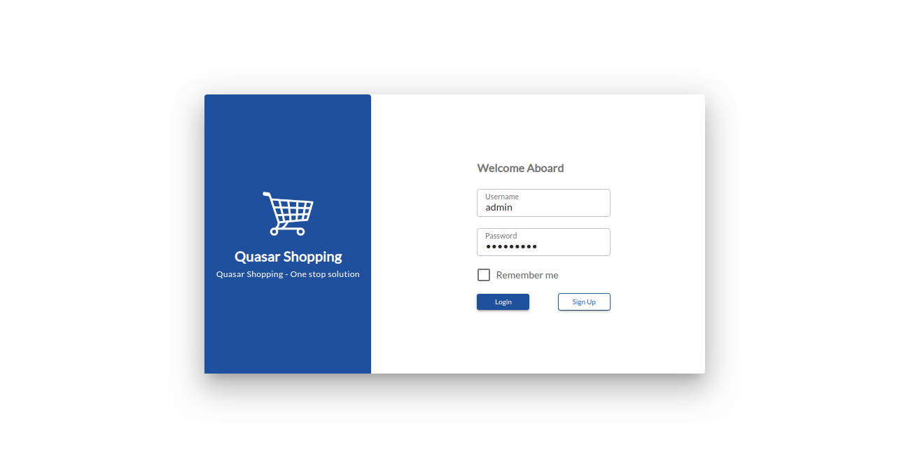
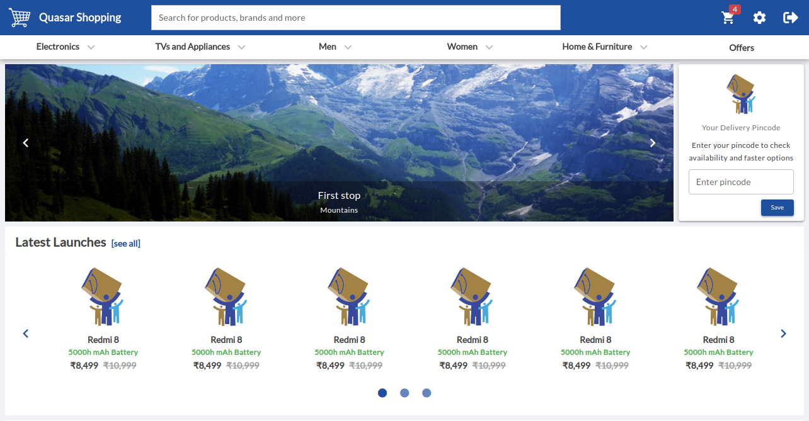
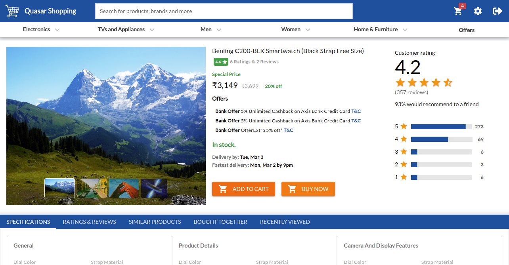
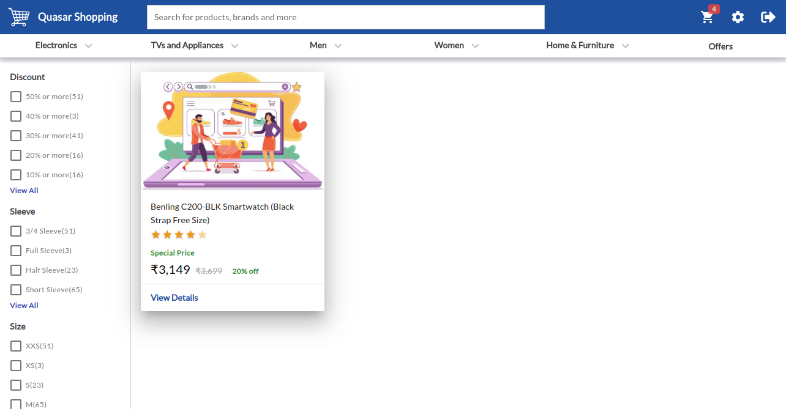

# Quasar Shopping

A free and beautiful eCommerce UI template written in Vue.js/Quasar.

## Site: [https://quasar-shopping.netlify.com/](https://quasar-shopping.netlify.com/)

## Resources used
* [Quasar Framework](https://quasar.dev/)
* [Vue.js](https://vuejs.org/)

## What it deliveres
* eCommerce UI template written in Vue.js/Quasar

## Future release:
* Mobile friendly
* Seller related pages
* Backend(planning to use [Python](https://www.python.org/))


## Installation

* **Clone the repository**

```
git clone https://github.com/mayur091193/quasar-shopping.git
```

## Install the dependencies
```bash
cd quasar-shopping
npm install
```

### To run the app in development mode (hot-code reloading, error reporting, etc.)
```bash
quasar dev
```


### Build the application
```bash
quasar build
```

Reach out to me at "mayur091193@gmail.com" for queries.

## Screens UI
**Login**
<p float="left">
        <kbd>

                </kbd>
</p>

**Home**
<p float="left">
	<kbd>

		</kbd>
</p>

**Details**
<p float="left">
	<kbd>
	
	</kbd>
</p>

**Category**
<p float="left">
	<kbd>

	</kbd>
</p>

**Footer**
<p float="left">
	<kbd>

	</kbd>
</p>

### Customize the configuration
See [Configuring quasar.conf.js](https://quasar.dev/quasar-cli/quasar-conf-js).

## License

[MIT](http://opensource.org/licenses/MIT)
